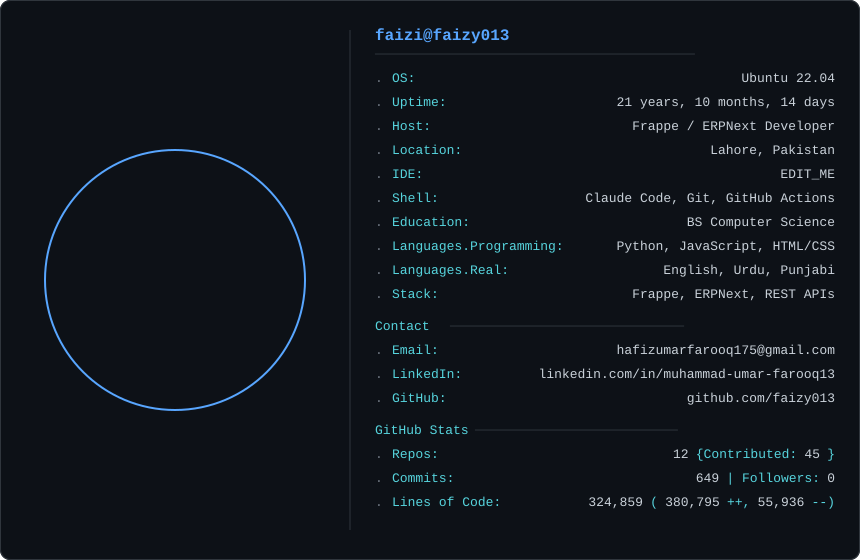

<a>
<picture>
  <source media="(prefers-color-scheme: dark)" srcset="dark_mode.svg">
  <source media="(prefers-color-scheme: light)" srcset="light_mode.svg">
  
</picture>
</a>


<!-- <h1 align="center">Hi, I'm Muhammad Umar Farooq 👋</h1>

<p align="center">
  <b>Python Developer &nbsp;|&nbsp; Frappe / ERPNext Specialist &nbsp;|&nbsp; Django Backend Engineer</b><br/>
  Building production-grade ERP solutions and web applications
</p>

<p align="center">
  <a href="https://www.linkedin.com/in/muhammad-umar-farooq13">
    
  </a>
  <a href="mailto:umarwork13@gmail.com">
    
  </a>
</p>

---

## 🧑‍💻 About Me

- 🔧 I specialize in **Frappe Framework & ERPNext** — custom apps, doctypes, workflows, server scripts, and REST API integrations
- 🐍 Strong background in **Python**, **Django**, and async task processing with **Celery + Redis**
- 🏭 Most of my production work lives in **private client repositories** — portfolio and case studies available on request
- 📍 Based in Lahore, Pakistan
- 🤝 Open to freelance projects and full-time remote roles in ERP/backend development

---

## 🛠 Tech Stack

**Languages**


**Frameworks & Platforms**


**Tools & Infrastructure**


---

## 💼 What I've Worked On (Private / Client Work)

> Most production projects are under NDA or in private repositories.
> Below is a summary of the types of systems I've built:

| Domain | What I Built |
|---|---|
| 🏭 ERPNext Customization | Custom doctypes, workflows, print formats, role-based permissions |
| 🔗 API Integration | Third-party REST API integrations via Frappe hooks and Python |
| 📊 Custom Reporting | Script reports with complex filters, Jinja2 print templates |
| ⚙️ Automation | Scheduled jobs, email alerts, bulk data processing scripts |
| 🌐 Django Web Apps | Full-stack apps with Celery async tasks and push notifications |

*Detailed case studies and code samples available on request.*

---

## 📂 Public Projects

### 🌿 [Wellness Tracker](https://github.com/faizy013/wellness-tracker)
A Django web app for tracking daily health activities — water intake, exercise, sleep, and mood.

**Stack:** Django · Celery · Redis · APScheduler · Chart.js · WebPush (VAPID)

- Automated email reminders twice daily via APScheduler
- Browser push notifications using VAPID keys
- Interactive charts (line, bar, pie, doughnut, radar) via Chart.js
- Custom green wellness UI theme

---

---

## 🌐 Portfolio Website

### 🔗 [faizy013.github.io](https://faizy013.github.io)

Personal portfolio website built and hosted using GitHub Pages.

**Tech Used:** HTML · CSS · JavaScript · GitHub Pages

- Responsive developer portfolio UI
- Showcases skills, projects, and experience
- Clean modern layout focused on backend/Frappe development
- Direct contact and social links integration

Repository:
```bash
https://github.com/faizy013/faizy013.github.io
```

## 📫 Get In Touch

If you're looking for a **Frappe/ERPNext developer** or a **Python backend engineer**, feel free to reach out:

- 💼 LinkedIn: https://www.linkedin.com/in/muhammad-umar-farooq13
- 📧 Email: umarwork13@gmail.com

---

<p align="center">
  
</p> -->
